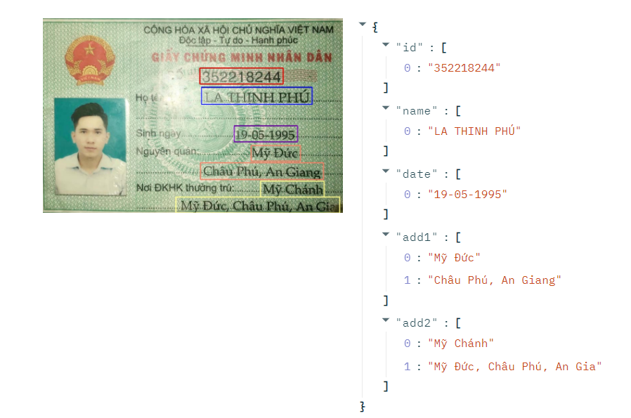

<h1 align="center">
<p> Vietnamese ID Card Recognition
</h1>

# Overview
A project to recognize text in Vietnamese ID card using Centernet-Custom and Seq2Seq-Attention models

# Setup 
Edit requirements_gpu.txt or requirements_cpu.txt depend on CPU or GPU, then run:
```bash 
sh setup.sh    
```


# Performances
| Model   | mAP(IOU=0.5-0.95) | Full Sequence Acc (%) |
|----------|----------------------|--------------------------------------|
| ```CMND Detect``` | x | x |
|``` Line Detect``` | 0.75 | x|
|``` OCR``` | x | 81%|


# Demo
Run demo from file [OCR_deploy.ipynb](./OCR_deploy.ipynb)

Result: 



